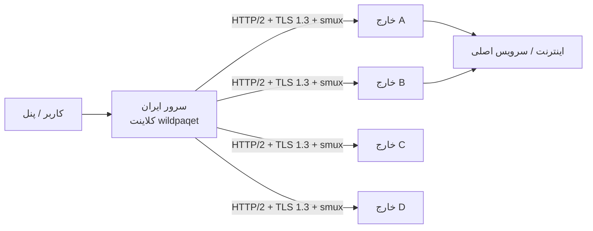

<div align="center">

# WildPaqet Tunnel

**تونل پوششی HTTP/2 واقعی روی TLS با سازگاری Direct-TLS و Raw-KCP**

[](https://github.com/infowild/WildPaqet-Tunnel/tree/wild-paqet-v3)
[](https://github.com/infowild/WildPaqet-Tunnel)
[](https://github.com/infowild/WildPaqet-Tunnel/blob/wild-paqet-v3/wildpaqet.sh)

[English](README.md) · [مخزن](https://github.com/infowild/WildPaqet-Tunnel) · [هسته v3](./core) · [نصب v3](docs/V3-INSTALL.md)

<br/>

### پایدار (main)

```bash
bash <(curl -fsSL https://raw.githubusercontent.com/infowild/WildPaqet-Tunnel/main/wildpaqet.sh)
```

### WildPaqet v3 (این برنچ)

```bash
bash <(curl -fsSL https://raw.githubusercontent.com/infowild/WildPaqet-Tunnel/wild-paqet-v3/wildpaqet.sh)
```

بعد از اولین اجرا:

```bash
wildpaqet
```

> منو **0 → 8** هستهٔ **WildPaqet Core v3** را از سورس می‌سازد. راهنما: [docs/V3-INSTALL.md](docs/V3-INSTALL.md).
</div>

---

## چرا WildPaqet؟

مدیریت حرفه‌ای هسته [paqet](https://github.com/hanselime/paqet) برای سناریوی **خارج ↔ ایران**:

| قابلیت | توضیح |
|--------|--------|
| یک دستور | نصب یک‌بار، اجرا با `wildpaqet` |
| دو نقش | سرور خارج + کلاینت ایران (Forward / SOCKS5) |
| چند لوکیشن | چند سرویس روی یک ایران → چند خارج |
| چند پورت | لیست پورت با کاما + tcp/udp |
| پاکسازی کامل | Uninstall برای برگرداندن تغییرات اسکریپت |

فورک نگهداری‌شده از [Paqet-Tunnel-Manager](https://github.com/behzadea12/Paqet-Tunnel-Manager).

---

## معماری



- **خارج:** `role: server`  
- **ایران:** Forward یا SOCKS5  
- **کلید و نسخه هسته** دو طرف یکسان باشد  

---

## شروع سریع

### ۱) اجرا با root

```bash
bash <(curl -fsSL https://raw.githubusercontent.com/infowild/WildPaqet-Tunnel/wild-paqet-v3/wildpaqet.sh)
```

در اولین اجرا دستور سیستمی `wildpaqet` **خودکار نصب** می‌شود. سپس برای ساخت هستهٔ v3: منو **0 → 8**.

اگر Go توزیع از نسخهٔ موردنیاز `core/go.mod` قدیمی‌تر باشد، نصب‌کننده از
تعویض خودکار toolchain استفاده می‌کند یا نسخهٔ رسمی Go را با بررسی checksum در
`/opt/wildpaqet-go` قرار می‌دهد؛ Go سیستمی جایگزین نمی‌شود.

### ۲) خارج → گزینه ۲

روی هر خارج حالت پوششی HTTP/2 را انتخاب کن، ترجیحاً certificate عمومی معتبر بده؛ ویزارد خودش certificateهای موجود Certbot، acme.sh و پنل‌های رایج را پیدا و لیست می‌کند و تطابق کلید خصوصی با certificate را بررسی می‌کند، پس معمولاً لازم نیست مسیر را دستی وارد کنی و از نام certificate و Secret یکسان روی همهٔ خارج‌ها استفاده کن. سپس کد `WPQ4` را کپی کن؛ اگر کد یک زنجیرهٔ certificate را حمل کند بلندتر از ظرفیت یک خط ترمینال است و به صورت بلوکی از خط‌های ۱۲۰ کاراکتری چاپ می‌شود که با خط `WPQEND` تمام می‌شود، پس کل بلوک را کپی کن یا فایل `pairing-code.txt` را با scp ببر. حالت self-signed فقط برای تست است.

### ۳) ایران → گزینه ۳

حالت پیش‌فرض **Paste pairing code(s)** را انتخاب کن، کدهای چهار خارج را یکی‌یکی paste کن و در پایان Enter خالی بزن. کد بلند را می‌توانی به صورت کل بلوک (همراه خط `WPQEND`) paste کنی یا به جای paste مسیر فایل `pairing-code.txt` را که با scp آورده‌ای بدهی. endpointها، بررسی certificate و CA bundle خودکار انجام می‌شوند. مقدار پیشنهادی چهار اتصال برای هر خارج را نگه دار (برای چهار خارج مجموعاً ۱۶ اتصال) و Secret را یک‌بار وارد کن.

### ۴) استفاده روزانه

```bash
wildpaqet
```

اگر `command not found` دیدی:

```bash
export PATH="/usr/local/bin:$PATH" && hash -r
# یا
/usr/local/bin/wildpaqet
```

---

## پیش‌فرض‌های Raw-KCP قدیمی (منیجر v3)

| مورد | سرور | کلاینت |
|------|------|--------|
| Mode | `normal` | `normal` |
| Conn | `1` | `1` |
| MTU | `1350` | `1350` |
| TCP preset | `default` | `default` |
| Encryption | `aes-128-gcm` | `aes-128-gcm` |

---

## ترنسپورت پوششی HTTP/2 واقعی در v3

کانفیگ جدید `tls.mode: h2` با SNI قابل‌مشاهده، ALPN استاندارد `h2` و ClientHello پوششی uTLS وارد TLS می‌شود و سپس واقعاً preface، SETTINGS و frameهای HTTP/2 را می‌فرستد. smux داخل بدنهٔ دوطرفه و احرازشدهٔ یک درخواست استاندارد HTTP/2 `CONNECT` قرار می‌گیرد. این روش WebSocket نیست و برخلاف نسخهٔ قبلی، `h2` را اعلام نمی‌کند که بلافاصله پروتکل خصوصی دیگری صحبت کند.

درخواست یا probe نامعتبر یک صفحهٔ معمولی داخلی یا وب‌سایت decoy محلی می‌بیند. احراز هویت تونل داخل TLS و با HMAC متصل به cover path مبهم، timestamp و nonce تصادفی انجام می‌شود؛ replay و اختلاف ساعت بیش از دو دقیقه fail-closed رد می‌شوند. برای مقاومت در برابر active probe، certificate عمومی معتبر قویاً توصیه می‌شود؛ self-signed همچنان برای probe قابل‌مشاهده است.

فایل‌های certificate و key هنگام handshake جدید بررسی می‌شوند و اگر Certbot/ACME آن‌ها را جایگزین کرده باشد خودکار reload می‌شوند؛ تمدید معمول certificate به restart کردن Paqet نیاز ندارد.

منیجر v9.5 از pairing `WPQ4` استفاده می‌کند که endpoint، نام عمومی certificate، cover path مبهم و certificate عمومی را دارد؛ کد بلند به صورت بلوکی با خط پایانی `WPQEND` چاپ و هنگام import دوباره به هم چسبانده می‌شود و فایل `pairing-code.txt` هم مستقیم پذیرفته می‌شود؛ Secret و private key در آن نیست و خود path کلید احراز هویت محسوب نمی‌شود. همهٔ خارج‌های یک pool باید نام certificate، cover path و Secret یکسان داشته باشند. مسیر پیش‌فرض از نام certificate و Secret مشتق می‌شود تا روی خارج‌های هماهنگ خودکار یکسان باشد. `WPQ3` و `mode: direct` قدیمی فقط برای سازگاری باقی مانده‌اند و پوشش HTTP/2 ندارند.

برای هر endpoint خارج چهار اتصال ساخته می‌شود و streamها round-robin پخش می‌شوند. supervisor اتصال بسته را بازسازی می‌کند. اتصال‌های HTTP/2 پس از عمر تصادفی‌شده تعویض می‌شوند؛ اتصال جایگزین ابتدا وارد pool می‌شود و اتصال قدیمی تا پایان streamهایش drain می‌شود. شروع اتصال و keepalive نیز jitter دارند. پس از سه خطای dial متوالی circuit آن endpoint برای ۳۰ ثانیه باز می‌شود و cooldown حداکثر تا پنج دقیقه رشد می‌کند.

برای بار کم دو اتصال، برای حالت متعادل چهار اتصال و فقط روی ایران قوی‌تر و بار هم‌زمان زیاد هشت اتصال به‌ازای هر خارج انتخاب کن. تعداد کاربر ثبت‌شده معیار ظرفیت نیست؛ پهنای‌باند هم‌زمان تعیین‌کننده است. سرور `1 vCPU / 1 GB` برای تست مناسب است؛ برای تولید از حدود `4 vCPU / 4 GB` شروع کن و حتماً با بار واقعی اندازه‌گیری کن.

راهنمای نصب: [docs/V3-INSTALL.md](docs/V3-INSTALL.md). نمونه کانفیگ‌ها: [ایران](core/example/client-tls.yaml.example) و [خارج](core/example/server-tls.yaml.example).

## سرعت آپلود و تأخیر زیر بار (9.15-v3)

آپلود روی همان لینک تقریباً یک‌چهارم دانلود بود. علت پهنای باند نبود، flow-control
بود. هر پنجره در این پشته، حجم دادهٔ در حال پرواز را به `پنجره ÷ RTT` محدود می‌کند،
پس **کوچک‌ترین پنجره** سقف یک جریان را تعیین می‌کند — هرچقدر هم لینک سریع باشد:

| لایه | قبل | حالا |
|---|---|---|
| پنجرهٔ دریافت HTTP/2، ایران به خارج | ۱ مگابایت (پیش‌فرض سرور Go) | `smuxbuf` |
| پنجرهٔ دریافت HTTP/2، خارج به ایران | ۴ مگابایت (پیش‌فرض transport در Go) | بدون تغییر |
| بافر session در smux (`smuxbuf`) | ۴ مگابایت | زیر ۲ گیگ RAM: ۴، وگرنه ۸ مگابایت |
| بافر هر استریم (`streambuf`) | در v1 نادیده گرفته می‌شد | ۲ یا ۴ مگابایت، روی v2 فعال |
| backlog ارسال‌نشدهٔ هر سوکت | نامحدود | ۱۲۸ کیلوبایت (`TCP_NOTSENT_LOWAT`) |
| پنجرهٔ دریافت TCP بیرونی | ۸ تا ۳۲ مگابایت | ۸ مگابایت، تا window scale روی ۷ بماند |

این پنجره‌ها دو لبه دارند و این پروژه از هر دو لبه ضربه خورد.

**خیلی کوچک** یعنی یک جریان سقف می‌خورد، هرچقدر هم لینک سریع باشد. **خیلی بزرگ**
یعنی صفی که یک انتقال حجیم می‌سازد، جلوی همهٔ استریم‌های دیگر همان اتصال بیرونی
می‌نشیند — چون smux همه را روی یک جریان TCP مالتی‌پلکس می‌کند. این دقیقاً همان
بالا رفتن پینگ و جیتر موقع شلوغی تانل است.

آپلود تک‌جریانی، و RTT تعاملی روی استریم دوم همان session در حالی که آن آپلود
در جریان است — روی گلوگاه ۱۰۰ مگابیتی با RTT پایهٔ ۱۰۰ میلی‌ثانیه:

| `smuxbuf` / `streambuf` | آپلود | پینگ زیر بار (بافر مسیر ۲MB) | (بافر مسیر ۸MB) |
|---|---|---|---|
| 4M / 2M | ۱۵۵ Mbps | ۲۳۸ms | ۲۳۸ms |
| **8M / 4M (حالا)** | **۲۴۰ Mbps** | **۲۷۵ms** | **۴۹۷ms** |
| 16M / 8M | ۵۴۶ Mbps | ۳۰۱ms | ۱۰۱۹ms |

نسخهٔ 9.13-v3 پنجرهٔ HTTP/2 را درست کرد ولی smux را به v2 برد بدون بزرگ‌کردن
`streambuf`؛ همان ۲ مگابایت به یک سقف جدید per-stream تبدیل شد که v1 اصلاً
نداشت. تلاش اول 9.14 هم بیش‌ازحد جبران کرد و روی مسیر بلوت‌شده یک ثانیه صف ایستا
ساخت. حالا 8M/4M وسط این معامله است و ویزارد هر دو طرف را چاپ می‌کند تا آگاهانه
جابه‌جایش کنید.

دو تغییر، هزینهٔ پنجرهٔ بزرگ را از آنچه جدول نشان می‌دهد کمتر می‌کند:

- بافر تحویل به HTTP/2 در کلاینت ۶۴ کیلوبایت است، نه ۲۵۶ کیلوبایتی که اول
  فرستادم. اندازه‌گیری: ۳۳ میلی‌ثانیه از RTT زیر بار کم شد.
- هر دو سر روی سوکت بیرونی **`TCP_NOTSENT_LOWAT`** (۱۲۸ کیلوبایت) می‌گذارند.
  چون smux همهٔ اتصالات کاربر را روی یک جریان TCP می‌گذارد، هر بایتی که به کرنل
  تحویل شده جلوی هر چیزی است که بعدش نوشته می‌شود؛ بدون سقف، یک آپلود می‌تواند
  مگابایت‌ها آنجا پارک کند. این throughput را محدود نمی‌کند — congestion control
  همچنان تصمیم می‌گیرد چقدر در پرواز باشد. فقط لینوکسی است و روی ماشین توسعه
  قابل اندازه‌گیری نبود، پس روی تانل شلوغ خودتان تأیید کنید:
  `ss -tim dst <kharej-ip> | grep -o 'notsent_lowat:[0-9]*'`

`streambuf` هم روی همان پنجرهٔ ۸ مگابایتی TCP که Optimizer اجازه می‌دهد متوقف
می‌شود — همانی که برای حفظ window scale استاندارد ۷ نگه داشته شده.

چهار تغییر دیگر همراه آن است:

چهار تغییر دیگر همراه آن است:

- کلاینت دیگر داده را از یک `io.Pipe` بدون بافر به HTTP/2 نمی‌دهد. آن pipe هر
  نوشتن را همگام تحویل می‌داد، پس تنها sendLoop در smux برای تمام مدت نوشتن هر
  DATA frame قفل می‌شد — و چون آن حلقه همهٔ استریم‌های session را سریالی می‌کند،
  یک آپلود که منتظر پنجرهٔ طرف مقابل بود، همهٔ کاربران آن اتصال را متوقف می‌کرد.
- بافر کپی از ۸ به ۳۲ کیلوبایت رسید و با اندازهٔ فریم smux هم‌تراز شد؛ یک فریم
  کامل حالا یک DATA frame، یک رکورد TLS و یک syscall است، نه چهارتا.
- `smux_version` در حالت `h2` پیش‌فرض **۲** شد. نسخهٔ ۱ اصلاً flow-control
  per-stream ندارد و `streambuf` را نادیده می‌گرفت، پس آن گزینه بی‌اثر بود و یک
  استریم کند می‌توانست سطل مشترک session را خالی کند. حالت `direct` قدیمی برای
  سازگاری روی نسخهٔ ۱ می‌ماند.
- استریم دیگر به‌محض تمام‌شدن یک جهت بسته نمی‌شود. smux نیم‌بستن ندارد، پس
  کلاینتی که آپلودش را تمام می‌کرد و سوکتش را نیم‌می‌بست، پاسخ را ناقص می‌گرفت؛
  حالا جهت باقی‌مانده یک مهلت کراندار برای تخلیه دارد.

> **هر دو سر را آپدیت کنید.** `smux_version: 2` با پیر قدیمی سازگار نیست و
> ناهماهنگی، اتصال را قطع می‌کند. روی همهٔ سرورهای ایران و خارج با `0 ← 8`
> هسته را دوباره بسازید و سرویس‌ها را ری‌استارت کنید. همان گزینه کلیدهای تنظیم
> را به کانفیگ‌های v3 موجود اضافه می‌کند و مقادیری که 9.13-v3 و تلاش اول 9.14-v3
> نوشته بودند را هم جایگزین می‌کند؛ مقادیری که خودتان انتخاب کرده‌اید دست‌نخورده می‌مانند.
> برای برگشت، روی هر دو سر `smux_version: 1` بگذارید.
>
> ویزارد حالا سقف تک‌جریانیِ کانفیگ شما را چاپ می‌کند تا شکایت از سرعت را بشود
> با خود کانفیگ سنجید، نه با حدس. یک تست سرعت تک‌جریانی نمی‌تواند از خط
> `streambuf ÷ RTT` بالاتر برود.

---

## سخت‌سازی ترافیک Raw قدیمی (8.7-v2)

مسیر تونل بین ایران و خارج قبلاً روی سیم خیلی راحت قابل تشخیص بود. پریست `default` حالا کاری می‌کند که این مسیر مثل یک کانکشن عادی TCP رفتار کند:

| قبلاً | حالا |
|-------|------|
| یک SYN تنها که جوابی نمی‌گرفت و بعد بلافاصله دیتا — مشکوک‌تر از نفرستادن SYN | هندشیک سه‌مرحله‌ای واقعی: سرور `SYN-ACK` می‌دهد و کلاینت با `ACK` تمامش می‌کند |
| SEQ/ACK شبه‌تصادفی و بی‌ربط به بایت‌های ارسالی | SEQ بایت‌های ارسالی را می‌شمارد، ACK بایت‌های دریافتی را، و timestamp طرف مقابل echo می‌شود |
| قبل از دیدن طرف مقابل، یک ACK تصادفی و TSecr ساختگی فرستاده می‌شد | تا وقتی فضای SEQ طرف مقابل واقعاً دیده نشود، هیچ ACK یا `TSecr` تبلیغ نمی‌شود |
| مارک DSCP 46 (`TOS 184`) روی همه پکت‌ها، همان کلاس مخصوص VoIP | بدون هیچ مارکی (`TOS 0`)، مثل ترافیک معمولی |
| `IP.id` ثابت صفر روی هر پکت DF — امضای واضح تونل حجیم | `IP.id` متحرک (IPv4) و flow label (IPv6) مثل یک استک واقعی |
| فلو وسط کار بی‌صدا قطع می‌شد | هنگام بستن، `FIN,ACK` تلاش‌محور فرستاده می‌شود |

**هر دو طرف** باید آپدیت شوند؛ هندشیک فقط وقتی کامل می‌شود که ایران و خارج هر دو این نسخه را داشته باشند. اگر `SYN-ACK` معتبر نیاید، کلاینت fail-closed هیچ دیتای تونلی ارسال نمی‌کند.

اگر خواستی رفتار قدیمی را برگردانی، روی هر دو طرف `network.tcp.preset: "legacy"` بگذار.

---

## منو

| # | کار |
|---|-----|
| 0 | نصب/آپدیت هسته و منیجر |
| 2 / 3 | کانفیگ خارج / ایران |
| 4 / 5 | مدیریت سرویس‌ها |
| 7 | بهینه‌سازی Safe/Auto شبکه + DNS / Mirror |
| 8 | حذف کامل |
| 9 | ربات تلگرام |

---

## آپدیت

```bash
wildpaqet
# 0 → 5
```

---

## حذف کامل

```bash
wildpaqet
# گزینه 8 → تایپ YES
```

سرویس، cron، هسته + بکاپ باینری، `$INSTALL_DIR`، سورس Core v3، ابزار Go ایزوله، کانفیگ‌ها، دستور `wildpaqet` / لینک‌های قدیمی، ربات تلگرام، sysctl/limits اسکریپت، قوانین علامت‌گذاری‌شدهٔ iptables/NAT، مجوزهای ثبت‌شدهٔ UFW/firewalld، کش `/root/paqet`، بکاپ‌ها، state مسیر `/var/lib/wildpaqet` و فایل‌های موقت build پاک می‌شوند. در پایان verifier هر مورد باقی‌مانده را گزارش می‌کند. Flush کامل قوانین قدیمی یا غیرمرتبط NAT فقط با تأیید جداگانه انجام می‌شود.

پاکسازی بهینه‌ساز شبکه هنگام حذف کامل **snapshot-aware** است: قدیمی‌ترین `/var/lib/wildpaqet/netopt/snap-*` به‌عنوان وضعیت واقعی قبل از WildPaqet بازگردانی می‌شود؛ فایل‌های قبلی sysctl/limits، مقادیر runtime و qdiscهایی که Optimizer تغییر داده بود نیز برمی‌گردند. سپس یونیت `wildpaqet-qdisc.service` و snapshotها حذف می‌شوند و دیگر `fq_codel`، `cubic` یا `pfifo_fast` به‌صورت اجباری اعمال نمی‌شود. NAT helper نیز فایل قبلی `30-ip_forward.conf` را بازمی‌گرداند و محتوای کاربر را کورکورانه حذف نمی‌کند.

پکیج‌های سیستم (curl، golang، …) دست نخورده می‌مانند. نصب‌کننده‌های BBR شخص‌ثالث جداگانه (در صورت وجود) هم دست نخورده می‌مانند.

### بهینه‌ساز Safe/Auto شبکه (منوی ۷)

از نسخه **8.6-v2** به بعد، Optimizer از نو بازنویسی شده است (Ubuntu/Debian و خانواده RHEL):

- فقط **`fq_codel`** — هرگز `fq` (لیمیت حدود ۱۰۰ پکت روی هر flow باعث لگ اسپایک روی تانل raw-packet می‌شود).
- ریشه **`mq`** چندصفی حفظ می‌شود؛ فقط leafهای `fq` زیر `mq` یا root تک‌صفی `fq` اصلاح می‌شوند.
- **BBR** فقط بعد از `modprobe` و بررسی دسترسی فعال می‌شود؛ وگرنه `cubic`.
- بافرها بر اساس RAM و محافظه‌کارانه (بدون مقادیر غول‌آسای backlog/conntrack و بدون اجبار `rp_filter` / `ip_forward`).
- قبل از اعمال، snapshot در `/var/lib/wildpaqet/netopt/`؛ **Rollback** همان snapshot را برمی‌گرداند.
- فقط اینترفیس‌های مسیر پیش‌فرض (`eth0`، `enp3s0`، …) — نه Docker/VPN.
- **Optimizer قدیمی** و `teddysun/bbr.sh` را دوباره اجرا نکنید؛ ممکن است دوباره `fq` بیاورند.

منو: **۷ → ۱** اعمال · **۲** وضعیت · **۳** Rollback · **۴** Reset فایل‌های متعلق به WildPaqet.

#### آنچه Optimizer عمداً دیگر تغییر نمی‌دهد (9.13-v3)

تیونینگ هاست می‌تواند نشت اطلاعاتی بدهد. دو تنظیم پروفایل قبلی برای یک ناظر
غیرفعال روی سیم قابل مشاهده بودند و در این سرعت‌ها هیچ سودی نداشتند، پس حذف شدند:

| تنظیم | قبل | حالا | چرا |
|---|---|---|---|
| `net.core.rmem_max` و `tcp_rmem[2]` | ۸ تا ۳۲ مگابایت | ۴ تا ۸ مگابایت | لینوکس **window scale** را که در هر SYN اعلام می‌کند از `max(rmem_max, tcp_rmem[2])` می‌سازد. لینوکس استاندارد **wscale 7** اعلام می‌کند؛ مقادیر قبلی **۹ یا ۱۰** اعلام می‌کردند که یک اثر انگشت پایدار و منفعل است. ۸ مگابایت پنجرهٔ دریافت روی RTT صد میلی‌ثانیه حدود ۶۴۰ مگابیت بر ثانیه برای هر اتصال می‌دهد. |
| `net.ipv4.ip_local_port_range` | `10000 65535` | پیش‌فرض توزیع | بازهٔ غیرپیش‌فرض، پورت مبدأ هر اتصال خروجی را بیرون از محدودهٔ معمول می‌برد و می‌تواند با سرویس‌های محلی تداخل کند. |

بافرهای سمت ارسال (`wmem_max` و `tcp_wmem`) همچنان با RAM بزرگ می‌شوند؛ هیچ‌چیز
از آن‌ها روی سیم اعلام نمی‌شود. اعمال پروفایل، `ip_local_port_range` را روی
هاست‌هایی که هنوز مقدار قدیمی را دارند هم برمی‌گرداند — حذف یک کلید از drop-in،
کرنل در حال اجرا را ریست نمی‌کند. `۷ ← ۲` (وضعیت) حالا window scale اعلام‌شدهٔ
همین هاست را نشان می‌دهد تا خودتان ببینید `7` است.

مواردی که عمداً نگه داشته شدند، با دلیلشان:

- **BBR** — از CUBIC قابل تفکیک است، ولی امروز روی اینترنت فراگیر است و نشانهٔ تانل نیست.
- **`tcp_slow_start_after_idle = 0`** — رفتار بعد از idle را به burst تبدیل می‌کند،
  ولی روی وب‌سرورها و CDNهای واقعی تیونینگ استانداردی است — دقیقاً همان چیزی که
  سرور خارج خودش را جای آن جا می‌زند.
- **`tcp_mtu_probing = 1`** — فقط وقتی ICMP black hole تشخیص داده شود فعال می‌شود،
  یعنی جایی که جایگزینش یک اتصال قفل‌شده است.
- **`fq_codel`** — از قبل پیش‌فرض systemd روی Debian/Ubuntu است. `fq` خالی همچنان
  رد می‌شود چون ترنسپورت raw-packet را زیر بار خراب می‌کند.

> گزینه‌های **DNS Finder** و **Mirror Selector** اسکریپت‌های شخص ثالثِ pin‌نشده را
> از گیت‌هاب با دسترسی root اجرا می‌کنند و اولی DNS سیستم را عوض می‌کند. WildPaqet
> محتوای آن‌ها را تأیید نمی‌کند و تانل به هیچ‌کدام نیاز ندارد: endpointهای v3 از
> pairing code به‌صورت IP:port می‌آیند، پس موقع کار هیچ نامی resolve نمی‌شود.
> هر دو پرامپت حالا قبل از تأیید این را می‌گویند.

---

## عیب‌یابی سریع

<details>
<summary><b>wildpaqet پیدا نمی‌شود</b></summary>

یک‌بار لانچر curl را با root اجرا کن، یا:
```bash
ls -l /usr/local/bin/wildpaqet
/usr/local/bin/wildpaqet
```
</details>

<details>
<summary><b>bad interpreter</b></summary>

معمولاً CRLF است — آپدیت منیجر (0→5)؛ اسکریپت `\r` را پاک می‌کند.
</details>

<details>
<summary><b>GLIBC / پورت اشغال</b></summary>

OS جدیدتر یا بیلد از سورس؛ برای پورت: `ss -tuln` / `lsof`.
</details>

---

## پیش‌نیاز

لینوکس + root + `libpcap` + `iptables` + `curl` + هسته paqet یکسان دو طرف

---

## قدردانی

- [paqet](https://github.com/hanselime/paqet) — hanselime  
- [Paqet-Tunnel-Manager](https://github.com/behzadea12/Paqet-Tunnel-Manager) — منیجر اولیه  

---

## لایسنس

MIT

<div align="center">

**WildPaqet** · [InfoWild](https://github.com/infowild)

</div>
