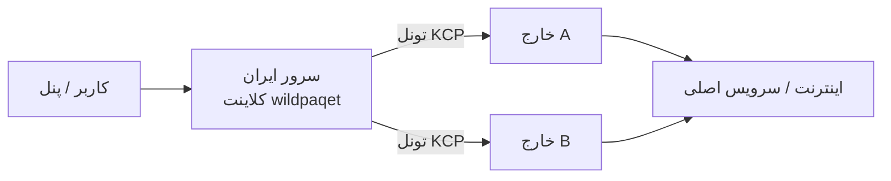

<div align="center">

# WildPaqet Tunnel

**منیجر تونل Raw-Packet + KCP برای شبکه‌های محدود**

[](https://github.com/infowild/WildPaqet-Tunnel)
[](https://github.com/infowild/WildPaqet-Tunnel)
[](https://github.com/infowild/WildPaqet-Tunnel/blob/main/wildpaqet.sh)

[English](README.md) · [مخزن](https://github.com/infowild/WildPaqet-Tunnel) · [هسته paqet](https://github.com/hanselime/paqet)

<br/>

```bash
bash <(curl -fsSL https://raw.githubusercontent.com/infowild/WildPaqet-Tunnel/main/wildpaqet.sh)
```

بعد از اولین اجرا:

```bash
wildpaqet
```

</div>

---

## چرا WildPaqet؟

مدیریت حرفه‌ای هسته [paqet](https://github.com/hanselime/paqet) برای سناریوی **خارج ↔ ایران**:

| قابلیت | توضیح |
|--------|--------|
| یک دستور | نصب یک‌بار، اجرا با `wildpaqet` |
| دو نقش | سرور خارج + کلاینت ایران (Forward / SOCKS5) |
| چند لوکیشن | چند سرویس روی یک ایران → چند خارج |
| چند پورت | لیست پورت با کاما + tcp/udp |
| پاکسازی کامل | Uninstall برای برگرداندن تغییرات اسکریپت |

فورک نگهداری‌شده از [Paqet-Tunnel-Manager](https://github.com/behzadea12/Paqet-Tunnel-Manager).

---

## معماری



- **خارج:** `role: server`  
- **ایران:** Forward یا SOCKS5  
- **کلید و نسخه هسته** دو طرف یکسان باشد  

---

## شروع سریع

### ۱) اجرا با root

```bash
bash <(curl -fsSL https://raw.githubusercontent.com/infowild/WildPaqet-Tunnel/main/wildpaqet.sh)
```

در اولین اجرا دستور سیستمی `wildpaqet` **خودکار نصب** می‌شود.

### ۲) خارج → گزینه ۲  
### ۳) ایران → گزینه ۳  
### ۴) استفاده روزانه

```bash
wildpaqet
```

اگر `command not found` دیدی:

```bash
export PATH="/usr/local/bin:$PATH" && hash -r
# یا
/usr/local/bin/wildpaqet
```

---

## پیش‌فرض‌های v7.1

| مورد | سرور | کلاینت |
|------|------|--------|
| Mode | `fast` | `fast` |
| Conn | `4` | `1` |
| MTU | `1350` | `1350` |
| Encryption | `aes-128-gcm` | `aes-128-gcm` |

---

## منو

| # | کار |
|---|-----|
| 0 | نصب/آپدیت هسته و منیجر |
| 2 / 3 | کانفیگ خارج / ایران |
| 4 / 5 | مدیریت سرویس‌ها |
| 7 | بهینه‌سازی |
| 8 | حذف کامل |
| 9 | ربات تلگرام |

---

## آپدیت

```bash
wildpaqet
# 0 → 5
```

---

## حذف کامل

```bash
wildpaqet
# گزینه 8 → تایپ YES
```

سرویس، cron، هسته، کانفیگ، دستور `wildpaqet`، ربات، sysctl/limits اسکریپت و قوانین محافظتی پاک می‌شوند. پکیج‌های سیستم و BBR خارجی دست نخورده می‌مانند.

---

## عیب‌یابی سریع

<details>
<summary><b>wildpaqet پیدا نمی‌شود</b></summary>

یک‌بار لانچر curl را با root اجرا کن، یا:
```bash
ls -l /usr/local/bin/wildpaqet
/usr/local/bin/wildpaqet
```
</details>

<details>
<summary><b>bad interpreter</b></summary>

معمولاً CRLF است — آپدیت منیجر (0→5)؛ اسکریپت `\r` را پاک می‌کند.
</details>

<details>
<summary><b>GLIBC / پورت اشغال</b></summary>

OS جدیدتر یا بیلد از سورس؛ برای پورت: `ss -tuln` / `lsof`.
</details>

---

## پیش‌نیاز

لینوکس + root + `libpcap` + `iptables` + `curl` + هسته paqet یکسان دو طرف

---

## قدردانی

- [paqet](https://github.com/hanselime/paqet) — hanselime  
- [Paqet-Tunnel-Manager](https://github.com/behzadea12/Paqet-Tunnel-Manager) — منیجر اولیه  

---

## لایسنس

MIT

<div align="center">

**WildPaqet** · [InfoWild](https://github.com/infowild)

</div>
