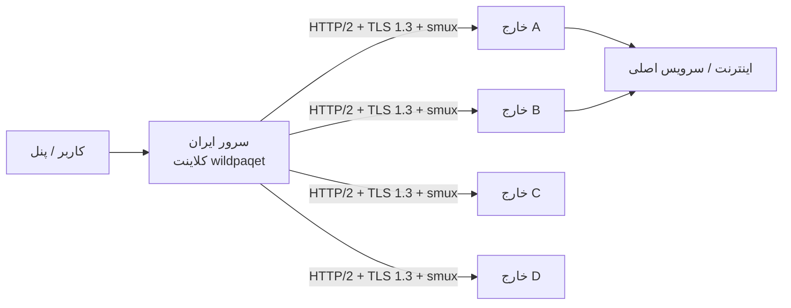

<div align="center">

# WildPaqet Tunnel

**تونل پوششی HTTP/2 واقعی روی TLS با سازگاری Direct-TLS و Raw-KCP**

[](https://github.com/infowild/WildPaqet-Tunnel/tree/wild-paqet-v3)
[](https://github.com/infowild/WildPaqet-Tunnel)
[](https://github.com/infowild/WildPaqet-Tunnel/blob/wild-paqet-v3/wildpaqet.sh)

[English](README.md) · [مخزن](https://github.com/infowild/WildPaqet-Tunnel) · [هسته v3](./core) · [نصب v3](docs/V3-INSTALL.md)

<br/>

### پایدار (main)

```bash
bash <(curl -fsSL https://raw.githubusercontent.com/infowild/WildPaqet-Tunnel/main/wildpaqet.sh)
```

### WildPaqet v3 (این برنچ)

```bash
bash <(curl -fsSL https://raw.githubusercontent.com/infowild/WildPaqet-Tunnel/wild-paqet-v3/wildpaqet.sh)
```

بعد از اولین اجرا:

```bash
wildpaqet
```

> منو **0 → 8** هستهٔ **WildPaqet Core v3** را از سورس می‌سازد. راهنما: [docs/V3-INSTALL.md](docs/V3-INSTALL.md).
</div>

---

## چرا WildPaqet؟

مدیریت حرفه‌ای هسته [paqet](https://github.com/hanselime/paqet) برای سناریوی **خارج ↔ ایران**:

| قابلیت | توضیح |
|--------|--------|
| یک دستور | نصب یک‌بار، اجرا با `wildpaqet` |
| دو نقش | سرور خارج + کلاینت ایران (Forward / SOCKS5) |
| چند لوکیشن | چند سرویس روی یک ایران → چند خارج |
| چند پورت | لیست پورت با کاما + tcp/udp |
| پاکسازی کامل | Uninstall برای برگرداندن تغییرات اسکریپت |

فورک نگهداری‌شده از [Paqet-Tunnel-Manager](https://github.com/behzadea12/Paqet-Tunnel-Manager).

---

## معماری



- **خارج:** `role: server`  
- **ایران:** Forward یا SOCKS5  
- **کلید و نسخه هسته** دو طرف یکسان باشد  

---

## شروع سریع

### ۱) اجرا با root

```bash
bash <(curl -fsSL https://raw.githubusercontent.com/infowild/WildPaqet-Tunnel/wild-paqet-v3/wildpaqet.sh)
```

در اولین اجرا دستور سیستمی `wildpaqet` **خودکار نصب** می‌شود. سپس برای ساخت هستهٔ v3: منو **0 → 8**.

اگر Go توزیع از نسخهٔ موردنیاز `core/go.mod` قدیمی‌تر باشد، نصب‌کننده از
تعویض خودکار toolchain استفاده می‌کند یا نسخهٔ رسمی Go را با بررسی checksum در
`/opt/wildpaqet-go` قرار می‌دهد؛ Go سیستمی جایگزین نمی‌شود.

### ۲) خارج → گزینه ۲

روی هر خارج حالت پوششی HTTP/2 را انتخاب کن، ترجیحاً certificate عمومی معتبر بده و از نام certificate و Secret یکسان روی همهٔ خارج‌ها استفاده کن. سپس کد یک‌خطی `WPQ4` را کپی کن. حالت self-signed فقط برای تست است.

### ۳) ایران → گزینه ۳

حالت پیش‌فرض **Paste pairing code(s)** را انتخاب کن، کدهای چهار خارج را یکی‌یکی paste کن و در پایان Enter خالی بزن. endpointها، بررسی certificate و CA bundle خودکار انجام می‌شوند. مقدار پیشنهادی چهار اتصال برای هر خارج را نگه دار (برای چهار خارج مجموعاً ۱۶ اتصال) و Secret را یک‌بار وارد کن.

### ۴) استفاده روزانه

```bash
wildpaqet
```

اگر `command not found` دیدی:

```bash
export PATH="/usr/local/bin:$PATH" && hash -r
# یا
/usr/local/bin/wildpaqet
```

---

## پیش‌فرض‌های Raw-KCP قدیمی (منیجر v3)

| مورد | سرور | کلاینت |
|------|------|--------|
| Mode | `normal` | `normal` |
| Conn | `1` | `1` |
| MTU | `1350` | `1350` |
| TCP preset | `default` | `default` |
| Encryption | `aes-128-gcm` | `aes-128-gcm` |

---

## ترنسپورت پوششی HTTP/2 واقعی در v3

کانفیگ جدید `tls.mode: h2` با SNI قابل‌مشاهده، ALPN استاندارد `h2` و ClientHello پوششی uTLS وارد TLS می‌شود و سپس واقعاً preface، SETTINGS و frameهای HTTP/2 را می‌فرستد. smux داخل بدنهٔ دوطرفه و احرازشدهٔ یک درخواست استاندارد HTTP/2 `CONNECT` قرار می‌گیرد. این روش WebSocket نیست و برخلاف نسخهٔ قبلی، `h2` را اعلام نمی‌کند که بلافاصله پروتکل خصوصی دیگری صحبت کند.

درخواست یا probe نامعتبر یک صفحهٔ معمولی داخلی یا وب‌سایت decoy محلی می‌بیند. احراز هویت تونل داخل TLS و با HMAC متصل به cover path مبهم، timestamp و nonce تصادفی انجام می‌شود؛ replay و اختلاف ساعت بیش از دو دقیقه fail-closed رد می‌شوند. برای مقاومت در برابر active probe، certificate عمومی معتبر قویاً توصیه می‌شود؛ self-signed همچنان برای probe قابل‌مشاهده است.

فایل‌های certificate و key هنگام handshake جدید بررسی می‌شوند و اگر Certbot/ACME آن‌ها را جایگزین کرده باشد خودکار reload می‌شوند؛ تمدید معمول certificate به restart کردن Paqet نیاز ندارد.

منیجر v9.3 از pairing یک‌خطی `WPQ4` استفاده می‌کند که endpoint، نام عمومی certificate، cover path مبهم و certificate عمومی را دارد؛ Secret و private key در آن نیست و خود path کلید احراز هویت محسوب نمی‌شود. همهٔ خارج‌های یک pool باید نام certificate، cover path و Secret یکسان داشته باشند. مسیر پیش‌فرض از نام certificate و Secret مشتق می‌شود تا روی خارج‌های هماهنگ خودکار یکسان باشد. `WPQ3` و `mode: direct` قدیمی فقط برای سازگاری باقی مانده‌اند و پوشش HTTP/2 ندارند.

برای هر endpoint خارج چهار اتصال ساخته می‌شود و streamها round-robin پخش می‌شوند. supervisor اتصال بسته را بازسازی می‌کند. اتصال‌های HTTP/2 پس از عمر تصادفی‌شده تعویض می‌شوند؛ اتصال جایگزین ابتدا وارد pool می‌شود و اتصال قدیمی تا پایان streamهایش drain می‌شود. شروع اتصال و keepalive نیز jitter دارند. پس از سه خطای dial متوالی circuit آن endpoint برای ۳۰ ثانیه باز می‌شود و cooldown حداکثر تا پنج دقیقه رشد می‌کند.

برای بار کم دو اتصال، برای حالت متعادل چهار اتصال و فقط روی ایران قوی‌تر و بار هم‌زمان زیاد هشت اتصال به‌ازای هر خارج انتخاب کن. تعداد کاربر ثبت‌شده معیار ظرفیت نیست؛ پهنای‌باند هم‌زمان تعیین‌کننده است. سرور `1 vCPU / 1 GB` برای تست مناسب است؛ برای تولید از حدود `4 vCPU / 4 GB` شروع کن و حتماً با بار واقعی اندازه‌گیری کن.

راهنمای نصب: [docs/V3-INSTALL.md](docs/V3-INSTALL.md). نمونه کانفیگ‌ها: [ایران](core/example/client-tls.yaml.example) و [خارج](core/example/server-tls.yaml.example).

## سخت‌سازی ترافیک Raw قدیمی (8.7-v2)

مسیر تونل بین ایران و خارج قبلاً روی سیم خیلی راحت قابل تشخیص بود. پریست `default` حالا کاری می‌کند که این مسیر مثل یک کانکشن عادی TCP رفتار کند:

| قبلاً | حالا |
|-------|------|
| یک SYN تنها که جوابی نمی‌گرفت و بعد بلافاصله دیتا — مشکوک‌تر از نفرستادن SYN | هندشیک سه‌مرحله‌ای واقعی: سرور `SYN-ACK` می‌دهد و کلاینت با `ACK` تمامش می‌کند |
| SEQ/ACK شبه‌تصادفی و بی‌ربط به بایت‌های ارسالی | SEQ بایت‌های ارسالی را می‌شمارد، ACK بایت‌های دریافتی را، و timestamp طرف مقابل echo می‌شود |
| قبل از دیدن طرف مقابل، یک ACK تصادفی و TSecr ساختگی فرستاده می‌شد | تا وقتی فضای SEQ طرف مقابل واقعاً دیده نشود، هیچ ACK یا `TSecr` تبلیغ نمی‌شود |
| مارک DSCP 46 (`TOS 184`) روی همه پکت‌ها، همان کلاس مخصوص VoIP | بدون هیچ مارکی (`TOS 0`)، مثل ترافیک معمولی |
| `IP.id` ثابت صفر روی هر پکت DF — امضای واضح تونل حجیم | `IP.id` متحرک (IPv4) و flow label (IPv6) مثل یک استک واقعی |
| فلو وسط کار بی‌صدا قطع می‌شد | هنگام بستن، `FIN,ACK` تلاش‌محور فرستاده می‌شود |

**هر دو طرف** باید آپدیت شوند؛ هندشیک فقط وقتی کامل می‌شود که ایران و خارج هر دو این نسخه را داشته باشند. اگر `SYN-ACK` معتبر نیاید، کلاینت fail-closed هیچ دیتای تونلی ارسال نمی‌کند.

اگر خواستی رفتار قدیمی را برگردانی، روی هر دو طرف `network.tcp.preset: "legacy"` بگذار.

---

## منو

| # | کار |
|---|-----|
| 0 | نصب/آپدیت هسته و منیجر |
| 2 / 3 | کانفیگ خارج / ایران |
| 4 / 5 | مدیریت سرویس‌ها |
| 7 | بهینه‌سازی Safe/Auto شبکه + DNS / Mirror |
| 8 | حذف کامل |
| 9 | ربات تلگرام |

---

## آپدیت

```bash
wildpaqet
# 0 → 5
```

---

## حذف کامل

```bash
wildpaqet
# گزینه 8 → تایپ YES
```

سرویس، cron، هسته + بکاپ باینری، `$INSTALL_DIR`، سورس Core v3، ابزار Go ایزوله، کانفیگ‌ها، دستور `wildpaqet` / لینک‌های قدیمی، ربات تلگرام، sysctl/limits اسکریپت، قوانین علامت‌گذاری‌شدهٔ iptables/NAT، مجوزهای ثبت‌شدهٔ UFW/firewalld، کش `/root/paqet`، بکاپ‌ها، state مسیر `/var/lib/wildpaqet` و فایل‌های موقت build پاک می‌شوند. در پایان verifier هر مورد باقی‌مانده را گزارش می‌کند. Flush کامل قوانین قدیمی یا غیرمرتبط NAT فقط با تأیید جداگانه انجام می‌شود.

پاکسازی بهینه‌ساز شبکه هنگام حذف کامل **snapshot-aware** است: قدیمی‌ترین `/var/lib/wildpaqet/netopt/snap-*` به‌عنوان وضعیت واقعی قبل از WildPaqet بازگردانی می‌شود؛ فایل‌های قبلی sysctl/limits، مقادیر runtime و qdiscهایی که Optimizer تغییر داده بود نیز برمی‌گردند. سپس یونیت `wildpaqet-qdisc.service` و snapshotها حذف می‌شوند و دیگر `fq_codel`، `cubic` یا `pfifo_fast` به‌صورت اجباری اعمال نمی‌شود. NAT helper نیز فایل قبلی `30-ip_forward.conf` را بازمی‌گرداند و محتوای کاربر را کورکورانه حذف نمی‌کند.

پکیج‌های سیستم (curl، golang، …) دست نخورده می‌مانند. نصب‌کننده‌های BBR شخص‌ثالث جداگانه (در صورت وجود) هم دست نخورده می‌مانند.

### بهینه‌ساز Safe/Auto شبکه (منوی ۷)

از نسخه **8.6-v2** به بعد، Optimizer از نو بازنویسی شده است (Ubuntu/Debian و خانواده RHEL):

- فقط **`fq_codel`** — هرگز `fq` (لیمیت حدود ۱۰۰ پکت روی هر flow باعث لگ اسپایک روی تانل raw-packet می‌شود).
- ریشه **`mq`** چندصفی حفظ می‌شود؛ فقط leafهای `fq` زیر `mq` یا root تک‌صفی `fq` اصلاح می‌شوند.
- **BBR** فقط بعد از `modprobe` و بررسی دسترسی فعال می‌شود؛ وگرنه `cubic`.
- بافرها بر اساس RAM و محافظه‌کارانه (بدون مقادیر غول‌آسای backlog/conntrack و بدون اجبار `rp_filter` / `ip_forward`).
- قبل از اعمال، snapshot در `/var/lib/wildpaqet/netopt/`؛ **Rollback** همان snapshot را برمی‌گرداند.
- فقط اینترفیس‌های مسیر پیش‌فرض (`eth0`، `enp3s0`، …) — نه Docker/VPN.
- **Optimizer قدیمی** و `teddysun/bbr.sh` را دوباره اجرا نکنید؛ ممکن است دوباره `fq` بیاورند.

منو: **۷ → ۱** اعمال · **۲** وضعیت · **۳** Rollback · **۴** Reset فایل‌های متعلق به WildPaqet.

---

## عیب‌یابی سریع

<details>
<summary><b>wildpaqet پیدا نمی‌شود</b></summary>

یک‌بار لانچر curl را با root اجرا کن، یا:
```bash
ls -l /usr/local/bin/wildpaqet
/usr/local/bin/wildpaqet
```
</details>

<details>
<summary><b>bad interpreter</b></summary>

معمولاً CRLF است — آپدیت منیجر (0→5)؛ اسکریپت `\r` را پاک می‌کند.
</details>

<details>
<summary><b>GLIBC / پورت اشغال</b></summary>

OS جدیدتر یا بیلد از سورس؛ برای پورت: `ss -tuln` / `lsof`.
</details>

---

## پیش‌نیاز

لینوکس + root + `libpcap` + `iptables` + `curl` + هسته paqet یکسان دو طرف

---

## قدردانی

- [paqet](https://github.com/hanselime/paqet) — hanselime  
- [Paqet-Tunnel-Manager](https://github.com/behzadea12/Paqet-Tunnel-Manager) — منیجر اولیه  

---

## لایسنس

MIT

<div align="center">

**WildPaqet** · [InfoWild](https://github.com/infowild)

</div>
