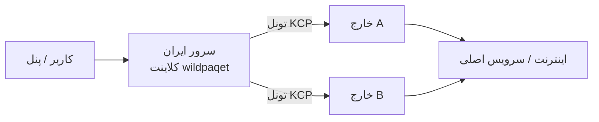

<div align="center">

# WildPaqet Tunnel

**منیجر تونل Raw-Packet + KCP برای شبکه‌های محدود**

[](https://github.com/infowild/WildPaqet-Tunnel/tree/wild-paqet-v2)
[](https://github.com/infowild/WildPaqet-Tunnel)
[](https://github.com/infowild/WildPaqet-Tunnel/blob/wild-paqet-v2/wildpaqet.sh)

[English](README.md) · [مخزن](https://github.com/infowild/WildPaqet-Tunnel) · [هسته v2](./core) · [نصب v2](docs/V2-INSTALL.md)

<br/>

### پایدار (main)

```bash
bash <(curl -fsSL https://raw.githubusercontent.com/infowild/WildPaqet-Tunnel/main/wildpaqet.sh)
```

### WildPaqet v2 (برنچ تست — پیشنهاد فعلی)

```bash
bash <(curl -fsSL https://raw.githubusercontent.com/infowild/WildPaqet-Tunnel/wild-paqet-v2/wildpaqet.sh)
```

بعد از اولین اجرا:

```bash
wildpaqet
```

> منو **0 → 8** هستهٔ **WildPaqet Core v2** را از سورس می‌سازد. راهنما: [docs/V2-INSTALL.md](docs/V2-INSTALL.md).
</div>

---

## چرا WildPaqet؟

مدیریت حرفه‌ای هسته [paqet](https://github.com/hanselime/paqet) برای سناریوی **خارج ↔ ایران**:

| قابلیت | توضیح |
|--------|--------|
| یک دستور | نصب یک‌بار، اجرا با `wildpaqet` |
| دو نقش | سرور خارج + کلاینت ایران (Forward / SOCKS5) |
| چند لوکیشن | چند سرویس روی یک ایران → چند خارج |
| چند پورت | لیست پورت با کاما + tcp/udp |
| پاکسازی کامل | Uninstall برای برگرداندن تغییرات اسکریپت |

فورک نگهداری‌شده از [Paqet-Tunnel-Manager](https://github.com/behzadea12/Paqet-Tunnel-Manager).

---

## معماری



- **خارج:** `role: server`  
- **ایران:** Forward یا SOCKS5  
- **کلید و نسخه هسته** دو طرف یکسان باشد  

---

## شروع سریع

### ۱) اجرا با root

```bash
bash <(curl -fsSL https://raw.githubusercontent.com/infowild/WildPaqet-Tunnel/wild-paqet-v2/wildpaqet.sh)
```

در اولین اجرا دستور سیستمی `wildpaqet` **خودکار نصب** می‌شود. سپس برای هستهٔ v2: منو **0 → 8**.

### ۲) خارج → گزینه ۲  
### ۳) ایران → گزینه ۳  
### ۴) استفاده روزانه

```bash
wildpaqet
```

اگر `command not found` دیدی:

```bash
export PATH="/usr/local/bin:$PATH" && hash -r
# یا
/usr/local/bin/wildpaqet
```

---

## پیش‌فرض‌های v7.1

| مورد | سرور | کلاینت |
|------|------|--------|
| Mode | `fast` | `fast` |
| Conn | `4` | `1` |
| MTU | `1350` | `1350` |
| TCP preset | `default` | `default` |
| Encryption | `aes-128-gcm` | `aes-128-gcm` |

---

## منو

| # | کار |
|---|-----|
| 0 | نصب/آپدیت هسته و منیجر |
| 2 / 3 | کانفیگ خارج / ایران |
| 4 / 5 | مدیریت سرویس‌ها |
| 7 | بهینه‌سازی Safe/Auto شبکه + DNS / Mirror |
| 8 | حذف کامل |
| 9 | ربات تلگرام |

---

## آپدیت

```bash
wildpaqet
# 0 → 5
```

---

## حذف کامل

```bash
wildpaqet
# گزینه 8 → تایپ YES
```

سرویس، cron، هسته + بکاپ باینری، `$INSTALL_DIR`، کلون سورس Core v2، کانفیگ‌ها، دستور `wildpaqet` / لینک‌های قدیمی، ربات تلگرام، sysctl/limits اسکریپت، قوانین iptables محافظتی، کش `/root/paqet`، بکاپ‌ها و فایل‌های موقت `/tmp/paqet*` پاک می‌شوند. Flush جدول NAT اختیاری است.

پاکسازی بهینه‌ساز شبکه هنگام حذف کامل **snapshot-aware** است: آخرین `/var/lib/wildpaqet/netopt/snap-*` بازگردانی می‌شود (تا مقادیر sysctl توزیع/کاربر برگردند)، سپس drop-inهای sysctl/limits متعلق به WildPaqet و یونیت بوت `wildpaqet-qdisc.service` حذف و خودِ snapshot پاک می‌شود. هرگز به‌صورت کور `cubic`/`pfifo_fast` تحمیل نمی‌شود؛ اگر `fq` زندهٔ باقی‌مانده باشد به `fq_codel` امن مهاجرت داده می‌شود.

پکیج‌های سیستم (curl، golang، …) دست نخورده می‌مانند. نصب‌کننده‌های BBR شخص‌ثالث جداگانه (در صورت وجود) هم دست نخورده می‌مانند.

### بهینه‌ساز Safe/Auto شبکه (منوی ۷)

از نسخه **8.4-v2** به بعد، Optimizer از نو بازنویسی شده است (Ubuntu/Debian و خانواده RHEL):

- فقط **`fq_codel`** — هرگز `fq` (لیمیت حدود ۱۰۰ پکت روی هر flow باعث لگ اسپایک روی تانل raw-packet می‌شود).
- ریشه **`mq`** چندصفی حفظ می‌شود؛ فقط leafهای `fq` زیر `mq` یا root تک‌صفی `fq` اصلاح می‌شوند.
- **BBR** فقط بعد از `modprobe` و بررسی دسترسی فعال می‌شود؛ وگرنه `cubic`.
- بافرها بر اساس RAM و محافظه‌کارانه (بدون مقادیر غول‌آسای backlog/conntrack و بدون اجبار `rp_filter` / `ip_forward`).
- قبل از اعمال، snapshot در `/var/lib/wildpaqet/netopt/`؛ **Rollback** همان snapshot را برمی‌گرداند.
- فقط اینترفیس‌های مسیر پیش‌فرض (`eth0`، `enp3s0`، …) — نه Docker/VPN.
- **Optimizer قدیمی** و `teddysun/bbr.sh` را دوباره اجرا نکنید؛ ممکن است دوباره `fq` بیاورند.

منو: **۷ → ۱** اعمال · **۲** وضعیت · **۳** Rollback · **۴** Reset فایل‌های متعلق به WildPaqet.

---

## عیب‌یابی سریع

<details>
<summary><b>wildpaqet پیدا نمی‌شود</b></summary>

یک‌بار لانچر curl را با root اجرا کن، یا:
```bash
ls -l /usr/local/bin/wildpaqet
/usr/local/bin/wildpaqet
```
</details>

<details>
<summary><b>bad interpreter</b></summary>

معمولاً CRLF است — آپدیت منیجر (0→5)؛ اسکریپت `\r` را پاک می‌کند.
</details>

<details>
<summary><b>GLIBC / پورت اشغال</b></summary>

OS جدیدتر یا بیلد از سورس؛ برای پورت: `ss -tuln` / `lsof`.
</details>

---

## پیش‌نیاز

لینوکس + root + `libpcap` + `iptables` + `curl` + هسته paqet یکسان دو طرف

---

## قدردانی

- [paqet](https://github.com/hanselime/paqet) — hanselime  
- [Paqet-Tunnel-Manager](https://github.com/behzadea12/Paqet-Tunnel-Manager) — منیجر اولیه  

---

## لایسنس

MIT

<div align="center">

**WildPaqet** · [InfoWild](https://github.com/infowild)

</div>
