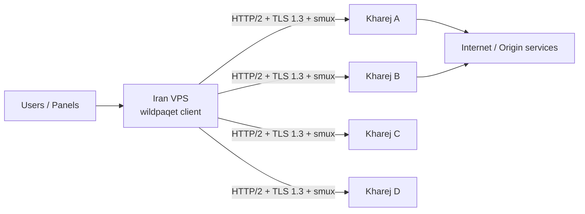

<div align="center">

# WildPaqet Tunnel

**Real HTTP/2-covered TLS tunnel with direct-TLS and raw-KCP compatibility**

[](https://github.com/infowild/WildPaqet-Tunnel/tree/wild-paqet-v3)
[](./core)
[](https://github.com/infowild/WildPaqet-Tunnel)
[](https://github.com/infowild/WildPaqet-Tunnel/blob/wild-paqet-v3/wildpaqet.sh)
[](https://github.com/infowild/WildPaqet-Tunnel)

[فارسی](README.fa.md) · [Repository](https://github.com/infowild/WildPaqet-Tunnel) · [Core tree](./core) · [v3 install](docs/V3-INSTALL.md)

<br/>

### Stable (main)

```bash
bash <(curl -fsSL https://raw.githubusercontent.com/infowild/WildPaqet-Tunnel/main/wildpaqet.sh)
```

### WildPaqet v3 (this branch)

```bash
bash <(curl -fsSL https://raw.githubusercontent.com/infowild/WildPaqet-Tunnel/wild-paqet-v3/wildpaqet.sh)
```

Then:

```bash
wildpaqet
```

> After first run, menu **0 → 8** builds **WildPaqet Core v3** from source. See [docs/V3-INSTALL.md](docs/V3-INSTALL.md).
</div>

---

## Why WildPaqet?

WildPaqet is a production-oriented tunnel manager for Kharej ↔ Iran deployments. v3 defaults to **real HTTP/2 over TLS 1.3 with smux inside the HTTP/2 body** over normal kernel TCP. Legacy direct TLS and hardened raw socket + KCP remain compatibility modes.

| | |
|---|---|
| **One command** | Install once, run forever with `wildpaqet` |
| **Dual role** | Abroad server + Iran entry (forward / SOCKS5) |
| **Multi tunnel** | Multiple services on one Iran VPS → many Kharej locations |
| **Multi port** | Comma-separated forwards with tcp / udp / both |
| **Safe migration** | Portable backup/restore with checksums, service state, cron, and TLS assets |
| **Safe cleanup** | Full uninstall restores script-owned system changes |

Forked and maintained from [Paqet-Tunnel-Manager](https://github.com/behzadea12/Paqet-Tunnel-Manager).

---

## Architecture



- **Kharej**: listens for the tunnel (`role: server`)
- **Iran**: terminates locally and **forwards ports** or exposes **SOCKS5**
- Same **32+ character secret** and **core version** on both sides; Iran trusts each Kharej certificate

---

## Quick Start

### 1) Launch (root)

```bash
bash <(curl -fsSL https://raw.githubusercontent.com/infowild/WildPaqet-Tunnel/wild-paqet-v3/wildpaqet.sh)
```

On first run the manager **auto-installs** the `wildpaqet` system command from this branch.

Then: **0 → 8** to build WildPaqet Core v3 from this branch.

If the distro Go compiler is older than `core/go.mod`, the installer uses Go
toolchain switching or downloads a checksum-verified official compiler under
`/opt/wildpaqet-go`; it does not replace the system Go installation.

### 2) Kharej

1. Option **2** → **v3 HTTP/2-covered TLS**
2. Use the same public certificate name and shared secret on all Kharej servers
3. Enter the DNS name that points at this Kharej server. The wizard reuses a still-valid public certificate for that name, or requests one from Let's Encrypt (HTTP-01 on TCP/80) and then locates the issued files. Self-signed mode is for testing only
4. Copy the `WPQ4` pairing code printed by each server; a code that carries a certificate chain is printed as a block of lines ending with `WPQEND`, and copying every line of it (or the saved `pairing-code.txt` file) keeps it intact

### 3) Iran

1. Option **3** → **v3 HTTP/2-covered TLS**
2. Choose the default **Paste pairing code(s)** option
3. Paste the four codes and submit an empty line; endpoints and the CA bundle are created automatically. A wrapped code may be pasted as a whole block, and a path to a `pairing-code.txt` copied with `scp` is accepted instead of a paste
4. Keep the recommended four outer connections per Kharej (16 total for four endpoints)
5. Enter the shared secret once, then choose Port Forward or SOCKS5

### 4) Daily use

```bash
wildpaqet
```

> If `wildpaqet: command not found`, run the curl launcher once as root, or:
> ```bash
> export PATH="/usr/local/bin:$PATH" && hash -r
> ```

---

## Stealth carrier, per-install decoy, traffic padding (9.18-v3 / Core v3.5.0)

Three changes, all aimed at what an observer can see rather than read.

**The decoy is now different on every install.** Answering a probe plausibly is
only half the job; if every WildPaqet server replies with the same bytes, one
internet-wide scan for that reply enumerates the whole fleet. Each server now
derives a web-server identity from its own shared secret - which nginx build it
claims to be, whether that build prints its version, when its `index.html` was
written, and therefore its `ETag`. It answers `/` with that page and everything
else with a 404, honours conditional and range requests, and replays of the
`ETag` get a `304` the way a file on disk would. Two installs measured
side by side now differ in `Server`, `ETag` and `Last-Modified`.

This replaces the earlier rule that forbade a welcome page outright. That rule
aimed at the right risk but paid for it by serving nothing at all, and a domain
with a valid public certificate that 404s its own root is its own anomaly.

**Traffic-shape padding, opt-in.** Measured on an idle tunnel, the wire carried
a TLS record of *exactly 39 bytes* every few seconds for as long as the
connection lived - twelve of the sixteen records after the handshake were that
one length. With `padding: true` the same run produced 19 records of 19
different lengths. Filler goes inside the encryption and only onto small
records, so a bulk transfer pays nothing on the wire. It changes the framing
between the two smux endpoints, so **both ends must set it**; it is off by
default and a mismatch drops the session, exactly as a `smux_version` mismatch
does.

**A stealth carrier: `mode: stealth`.** The HTTP/2 cover answers "what is this
connection?" with a plausible lie. That is the right answer where a censor
classifies traffic; it is the wrong one where the connection is being filtered
rather than fingerprinted. Stealth gives no answer at all: a Noise NNpsk0
handshake whose two messages are indistinguishable from random bytes, then a
ChaCha20-Poly1305 record layer that looks the same, with padding always on. The
pre-shared key comes from the tunnel secret, and because NNpsk0 mixes it in from
the first message, a peer without it gets **no reply whatsoever** - a scan finds
a dead port. It needs no certificate, no SNI and no ALPN.

It is not strictly better than the cover, and the wizard says so: traffic with
no recognisable protocol is itself a category a censor can decide to block.
Reach for it when the HTTP/2 cover is the thing being filtered.

Both ends must run the same carrier. Nothing here changes the h2 wire format
unless you turn padding on.

---

## Probe resistance and manager hardening (9.17-v3 / Core v3.4.2)

An active prober is the part of the threat model the cover story used to fail.
Two measured signals are gone:

- **The default decoy no longer identifies the host as a Go program.** With
  `decoy_url` unset the endpoint answered every path and every method with Go's
  literal `404 page not found` body and no `Server` header. It now answers like
  an ordinary web server. Pointing `decoy_url` at a site you already run is
  still the better configuration and the wizard now says so.
- **The server accepts TLS 1.2 again.** Practically every real HTTPS site does;
  refusing one separated this endpoint from the web in a single unauthenticated
  handshake. The tunnel itself never downgrades - the cover client now rejects
  any session that does not negotiate TLS 1.3, because in 1.2 the server
  certificate travels in the clear.

The wizard also warns that legacy `direct` TLS has no cover at all: it uses the
Go TLS fingerprint rather than a browser one, omits SNI unless enabled, and
follows the handshake with a fixed-size authentication record.

On the manager side:

- `wildpaqet` `0 -> 5` now stages and validates its download before replacing
  the live command. A captive portal or proxy notice returns HTTP 200 and used
  to overwrite the installed manager with an error page.
- Downloaded core archives are checked against a `.sha256` published beside each
  release tarball; a mismatch aborts the install.
- UDP port-forward firewall rules are removed on service removal and full
  uninstall. They were left open, and their presence made uninstall report
  failure and keep its state directory.
- A cover path such as `/api/v1/events/` is rejected by the wizard instead of
  producing a config the core refuses to load.
- A shared secret or SOCKS5 password containing a quote or backslash is escaped
  into the YAML instead of corrupting it.

Both ends can be upgraded independently; nothing here changes the wire protocol.

---

## Core v3.4.1 transport resilience

The v3 branch now builds **WildPaqet Core v3.4.1**. This release fixes endpoint
recovery, keeps shared HTTP/2 sessions under the background supervisor instead
of a user's setup deadline, and limits stalled TCP-forward setup work to 256
pending connections per forwarder with a 15-second default timeout. Active
relays do not consume pending slots and are not stopped by that setup timeout.

HTTP/2 heartbeat intervals are resampled for every probe and redundant NOPs are
suppressed while other outbound frames are active. The bundled smux v1.5.53
patch does not change the wire format; `smux_version` must still match on both
peers.

`tls.mode` is now required explicitly. Existing legacy deployments must use
`mode: direct` on both sides. Select `mode: h2` only when both peers are
configured for the HTTP/2 carrier. An empty `decoy_url` returns standard 404,
an unavailable configured backend returns 502, and unauthenticated CONNECT
requests receive 404.

Read the [v3.4.1 resilience and upgrade notes](docs/V3-RESILIENCE.md) before
updating both peers. These software fixes do not establish the cause of a
network block or guarantee invisibility to DPI.

---

## TLS certificate sync across Kharej servers (9.20-v3)

Every Kharej server in one pool must serve a certificate for the **same name**:
the `tls` block carries a single `server_name`, and it is the SNI, the name the
client verifies, and the HTTP/2 `Host` header all at once.

Where the domain's DNS provider has an API `acme.sh` supports, issue a
certificate on each server with **DNS-01** instead — that needs none of this and
survives losing any one server. This menu is for when no such API is available:
one server owns the ACME account and the others copy the pair from it.

```text
C → 2  on the new Kharej: create its pull key (prints one line)
C → 1  on the server that owns the certificate: register that key
C → 3  on the new Kharej: pull the certificate + daily refresh
C → 4  status and recent sync log
```

Three decisions behind it:

**Pull, not push.** A renewal hook on the source runs once every sixty days, so
a peer that happens to be unreachable at that moment loses the certificate
silently and only finds out when it expires. A daily pull retries on its own,
and warns in `journalctl -t wp-cert-pull` once fewer than 20 days remain.

**The peer key is pinned to one command.** The `authorized_keys` line is written
as `command="/usr/local/bin/wp-cert-export",restrict`, so a compromised replica
cannot read anything else on the source.

**Nothing is restarted.** The core re-reads the pair on the next handshake
(`certificateReloader`), so a restart would only drop every user's session for a
file swap they would otherwise never notice.

A download is validated before it replaces anything: it must parse, be valid for
that domain, and its key must match the certificate. All three are needed — a
valid certificate for a *different* name passes the first two and then fails on
the client, which verifies the name.

`C → 5` and the full uninstall remove every part of it, and take **only** the
pinned line out of `authorized_keys`, never your own key.

---

## Portable backup, restore, and migration (9.16-v3)

Press **`B`** in the main menu. A portable backup includes configs and secrets,
CA files, referenced TLS certificate/key files, Paqet service state, Paqet-only
cron entries, and offline copies of the manager/core binaries. Every archived
file is covered by an internal SHA-256 manifest that is checked before restore.
The companion `.sha256` file is also checked automatically when present, so
transfer both files when possible.

```text
B → 1  Create a portable backup
B → 2  Restore or migrate
B → 3  Verify an archive
B → 4  List local archives
```

Archives are stored under `/root/wildpaqet-portable-backups/` with mode `600`.
Since 9.19-v3 the full uninstall asks separately whether to remove them,
defaulting to yes because they carry secrets and private keys; keeping them
prints an explicit warning that those keys remain on the host. Transfer them only over SSH/SCP: they
are not encrypted, contain tunnel secrets, and may contain private TLS keys.
Restore uses merge semantics, overwrites configs with
matching names, and first creates a rollback backup when the destination
already has configs. A destination's installed binaries are preserved; bundled
binaries are installed only when missing.

Firewall allowances/protection are rebuilt from the restored configs. Network
optimizer snapshots and raw firewall tables are intentionally not copied
because they are host-specific. HTTP/2/TLS configs can be started after the
restore confirmation. Raw KCP/pcap configs are not auto-started on a different
machine until their interface, local address, and gateway MAC are reconfigured.
Keep the old Iran host online until traffic tests pass, then move client IPs or
DNS.

---

## Features

<table>
<tr>
<td width="50%">

### Tunnel ops
- Server / Client wizards
- Multi-port forwarding
- Built-in SOCKS5
- Multi-service (multi-location)
- systemd + optional auto-restart cron

</td>
<td width="50%">

### Ops & safety
- Connection protection (Anti-RST / NOTRACK, raw transport only)
- NAT helpers
- MTU / bulk config tools
- Telegram status bot
- Full uninstall (`YES` confirm)

</td>
</tr>
</table>

---

## Legacy raw-KCP defaults (v3 manager)

| Setting | Server | Client |
|--------|--------|--------|
| KCP mode | `normal` | `normal` |
| Connections | `1` | `1` |
| MTU | `1350` | `1350` |
| TCP preset | `default` | `default` |
| Encryption | `aes-128-gcm` | `aes-128-gcm` |
| Command | `wildpaqet` | `wildpaqet` |

---

## Real HTTP/2 cover transport (9.3-v3)

New `tls.mode: h2` configurations negotiate TLS with visible SNI, ALPN `h2`, and a uTLS ClientHello, then send the standards-required HTTP/2 preface, SETTINGS and DATA frames. Smux remains inside one authenticated, full-duplex HTTP/2 `CONNECT` request. This is not WebSocket and does not falsely advertise HTTP/2 while speaking a private protocol immediately after TLS.

Ordinary HTTP requests receive the configured local website or standard 404; unauthenticated CONNECT receives 404. A failed website backend returns 502, never a shared welcome page. Tunnel authentication is an encrypted HMAC token bound to the opaque cover path, timestamp and random nonce. Replays and timestamps outside the two-minute window fail closed. A publicly trusted certificate is strongly recommended because a self-signed certificate remains visible to an active probe.

Certificate and key files are checked on each new TLS handshake and reloaded after ACME/Certbot replaces them; routine certificate renewal therefore does not require a Paqet restart.

Manager v9.5 uses `WPQ4` pairing codes containing the endpoint, public certificate name, opaque cover path and public certificate. A code that carries a certificate chain does not fit on one terminal line, so it is printed as a block ending with `WPQEND` and reassembled on import; `pairing-code.txt` can be copied with `scp` instead. They contain neither the shared secret nor private key. The cover path is routing metadata, not an authentication secret. All endpoints in one pool must use the same certificate name, cover path and shared secret. The wizard derives the default path from the certificate name and shared secret, so matching Kharej nodes get the same path automatically. Legacy `WPQ3` / `mode: direct` configurations remain supported but do not provide the HTTP/2 cover.

Four outer connections per Kharej endpoint distribute new streams round-robin. A background supervisor rebuilds closed slots. HTTP/2 connections rotate after a jittered lifetime; the replacement enters the pool first and the old connection drains existing streams before closing. Connection startup and smux keepalives are also jittered. Three consecutive dial failures open that endpoint's circuit for 30 seconds, with exponential cooldown capped at five minutes and a single half-open probe.

Use two connections per endpoint for low traffic, four for balanced production traffic, or eight only for high concurrency on a larger Iran VPS. Registered-user count is not a capacity figure: size the Iran host and uplink for simultaneous traffic. A 1-vCPU/1-GB host is suitable for testing; start production sizing around 4 vCPU / 4 GB and verify with a representative load test.

See [the v3 install guide](docs/V3-INSTALL.md) and the [client](core/example/client-tls.yaml.example) / [server](core/example/server-tls.yaml.example) examples.

## Upload throughput and latency under load (9.15-v3)

Uploads used to run at roughly a quarter of download speed on the same link.
The cause was flow control, not bandwidth. Every window in the stack bounds
in-flight bytes to `window / RTT`, so the smallest one sets the ceiling for a
single flow regardless of how fast the link is:

| Layer | Before | Now |
|---|---|---|
| HTTP/2 receive window, Iran to Kharej | 1 MiB (Go's server default) | `smuxbuf` |
| HTTP/2 receive window, Kharej to Iran | 4 MiB (Go's transport default) | unchanged |
| smux session buffer (`smuxbuf`) | 4 MiB | 4 MiB under 2 GB RAM, else 8 MiB |
| smux per-stream buffer (`streambuf`) | ignored on v1 | 2 MiB / 4 MiB, live on v2 |
| Unsent backlog per socket | unlimited | 128 KiB (`TCP_NOTSENT_LOWAT`) |
| Outer TCP receive window | 8–32 MB | 8 MB, to hold window scale at the stock 7 |

These windows cut both ways, and this project got caught by each side in turn.

**Too small** and one flow is capped however fast the link is. **Too large** and
the queue a bulk transfer builds sits ahead of every other stream on the same
outer connection, because smux multiplexes them all onto one TCP stream - which
is ping and jitter climbing whenever the tunnel is busy.

Single-flow upload, and interactive round-trip on a second stream of the same
session while that upload runs, over a 100 Mbps bottleneck at 100 ms base RTT:

| `smuxbuf` / `streambuf` | upload | ping under load (2 MB path buffer) | (8 MB path buffer) |
|---|---|---|---|
| 4M / 2M | 155 Mbps | 238 ms | 238 ms |
| **8M / 4M (now)** | **240 Mbps** | **275 ms** | **497 ms** |
| 16M / 8M | 546 Mbps | 301 ms | 1019 ms |

9.13-v3 fixed the HTTP/2 window but switched smux to v2 without resizing
`streambuf`, turning that 2 MiB value into a new per-stream ceiling v1 never
had. The first 9.14 attempt then over-corrected to 16M/8M and bought a second of
standing queue on a bufferbloated path. 8M/4M is the middle, and the wizard now
prints both sides so the value can be moved deliberately.

Two changes make a large window cheaper than the table suggests:

- The client's HTTP/2 hand-off buffer is 64 KiB, not the 256 KiB first shipped.
  Measured: 33 ms off the loaded round trip.
- Both ends set **`TCP_NOTSENT_LOWAT`** (128 KiB) on the outer socket. smux puts
  every user connection on one TCP stream, so anything already handed to the
  kernel sits ahead of everything written after it; without a cap an upload can
  park megabytes there. It does not cap throughput - the congestion controller
  still decides what is in flight. This is Linux-only and could not be measured
  on the development machine, so confirm it on a busy tunnel with
  `ss -tim dst <kharej-ip> | grep -o 'notsent_lowat:[0-9]*'`.

`streambuf` also stops at the 8 MB outer TCP receive window the optimizer allows,
which is held there so hosts keep advertising the stock TCP window scale of 7.

Four other changes go with it:

Four other changes go with it:

- The client no longer feeds HTTP/2 through an unbuffered `io.Pipe`. That pipe
  handed off every write synchronously, so smux's single sendLoop stalled for
  the whole duration of each DATA frame write - and because that loop
  serialises every stream on the session, one upload waiting on the peer's
  window stopped all other users on the same outer connection.
- The relay copy buffer is 32 KiB instead of 8 KiB, matching smux's frame size,
  so a full frame is one DATA frame, one TLS record and one syscall instead of
  four.
- `smux_version` defaults to **2** in `h2` mode. v1 has no per-stream flow
  control and ignored `streambuf` entirely, so that setting was a dead knob and
  one slow stream could drain the shared session bucket. Legacy `direct` mode
  stays on v1 for wire compatibility.
- A stream is no longer torn down the instant one direction ends. smux has no
  half-close, so a client that finished its upload and half-closed its socket
  used to truncate the reply; the surviving direction now gets a bounded grace
  period to drain.

> **Update both ends.** `smux_version: 2` is not compatible with an older peer,
> and a mismatch fails the connection outright. Rebuild the core with `0 -> 8`
> on every Iran and Kharej node, then restart the services. Menu `0 -> 8` also
> back-fills the tuning keys into existing v3 configs and replaces the values
> 9.13-v3 and the first 9.14-v3 wrote; values you chose yourself are left alone. Set
> `smux_version: 1` on both ends to fall back.
>
> The wizard now prints the single-flow ceiling your configuration implies, so
> a throughput complaint can be checked against the config rather than guessed
> at. A single-flow speed test cannot exceed the `streambuf / RTT` line.

---

## Legacy raw wire hardening (8.7-v2)

The tunnel leg between Iran and Kharej used to be easy to single out on the wire. Preset `default` now makes it behave like an ordinary TCP connection:

| Before | Now |
|--------|-----|
| A lone SYN with no answer, then data — worse than no handshake at all | Fail-closed three-way handshake: SYN retries use backoff and no tunnel data is sent without a valid `SYN-ACK` |
| SEQ/ACK were pseudo-random and unrelated to the bytes sent | SEQ counts bytes sent, ACK follows bytes received, timestamps echo the peer |
| A random ACK / fabricated timestamp echo was sent before the peer was ever seen | No ACK or `TSecr` is advertised until the peer's sequence space is actually observed |
| Every packet marked DSCP 46 (`TOS 184`), the expedited-forwarding class used by VoIP | No DSCP mark (`TOS 0`), like normal traffic |
| `IP.id` fixed at 0 on every DF packet — a bulk-tunnel giveaway | Moving `IP.id` (IPv4) / flow label (IPv6), like a real stack |
| Flows just went silent mid-stream | Best-effort `FIN,ACK` teardown on close |
| Packet-count timestamps and no outer loss recovery | Monotonic timestamps plus cumulative ACK and bounded outer TCP retransmission with the original SEQ |
| Tight reconnect loops and a fixed two-second keepalive | Exponential retry jitter and conservative `15s/60s` SMUX keepalive/timeout |

Update **both ends** — the handshake and outer ACK/retransmission behaviour require Iran and Kharej to run the same build. A missing or invalid `SYN-ACK` now fails closed instead of sending data on an unestablished flow.

Set `network.tcp.preset: "legacy"` on both sides to restore the old wire behaviour if you need to compare.

---

## Menu Map

| # | Action |
|---|--------|
| 0 | Install / update core & manager |
| 1 | Dependencies |
| 2 | Configure Kharej server |
| 3 | Configure Iran client |
| 4 | Manage one service |
| 5 | Manage all (NAT, protection, bulk) |
| 6 | Connectivity tests |
| 7 | Optimize (Safe/Auto network + DNS / Mirror) |
| B | Portable backup, restore, and migration |
| C | TLS certificate sync across Kharej servers |
| 8 | **Full uninstall** |
| 9 | Telegram bot |
| 10 | Exit |

---

## Update

```bash
wildpaqet
# 0 → 5 Update script
```

Or re-run the curl one-liner.

---

## Uninstall (full cleanup)

```bash
wildpaqet
# option 8 → type YES
```

Removes **all** script/tunnel artifacts: services, cron, core + internal binary backups, `$INSTALL_DIR`, the Core v3 source tree, the isolated Go toolchain, configs, `wildpaqet` / legacy links, Telegram bot, script sysctl/limits, managed iptables/NAT rules, tracked UFW/firewalld allowances, `/root/paqet`, `/root/paqet-backups`, state under `/var/lib/wildpaqet`, certificate-sync scripts, key and cron, and temporary build files. Portable migration archives under `/root/wildpaqet-portable-backups` are asked about separately, because the archive is also the migration path off this host. The final verifier reports any managed artifact that could not be removed. A separate opt-in prompt can flush untracked legacy/non-WildPaqet NAT rules.

Network optimizer cleanup during uninstall is **snapshot-aware**: it restores the oldest `/var/lib/wildpaqet/netopt/snap-*` as the true pre-WildPaqet baseline, including prior sysctl/limits files, captured runtime sysctl values, and qdisc kinds changed by the optimizer. It then removes the `wildpaqet-qdisc.service` boot unit and snapshot store without forcing `fq_codel`, `cubic`, or `pfifo_fast`. The NAT helper likewise restores a pre-existing `30-ip_forward.conf` instead of deleting user content.

Does **not** remove distro packages (curl, iptables-persistent, golang, …). External third-party BBR installers (if you ran them separately) are left alone.

### Safe/Auto Network Optimizer (menu 7)

WildPaqet **8.6-v2+** ships a rewritten Safe/Auto optimizer for Ubuntu/Debian and RHEL-family hosts:

- Uses **`fq_codel`** only — never `fq` (which caps each kernel flow at ~100 packets and collapses raw-packet Paqet tunnels under load).
- Preserves **`mq`** multi-queue roots; only retargets `fq` leaves under `mq`, or replaces a single-queue `fq` root.
- Enables **BBR** only after `modprobe` + availability check; otherwise keeps/falls back to `cubic`.
- Conservative RAM-scaled buffers (no 256MB max / huge backlog / mega conntrack / forced `rp_filter` / `ip_forward`).
- Snapshots under `/var/lib/wildpaqet/netopt/` before apply; **Rollback** restores the last snapshot (not a blind `cubic`/`pfifo_fast` wipe).
- Remediates live qdisc on **default-route** interfaces only (`eth0`, `enp3s0`, …) — not Docker/VPN virtuals.
- **Do not** re-run old manager “Kernel Optimization” / remote `teddysun/bbr.sh` flows — they can reintroduce `fq`.

Menu: **7 → 1** Apply · **2** Status · **3** Rollback · **4** Reset owned drop-ins · DNS Finder / Mirror Selector.

#### What the optimizer deliberately does *not* change (9.13-v3)

Host tuning can leak. Two settings in the old profile were visible to a passive
observer and bought nothing at these link speeds, so they are gone:

| Setting | Old | Now | Why |
|---|---|---|---|
| `net.core.rmem_max`, `tcp_rmem[2]` | 8–32 MB | 4–8 MB | Linux picks the **TCP window scale it advertises in every SYN** from `max(rmem_max, tcp_rmem[2])`. Stock Linux advertises **wscale 7**; the old values advertised **9 or 10**, a stable passive fingerprint. 8 MiB of receive window already sustains ~640 Mbps per connection at 100 ms RTT. |
| `net.ipv4.ip_local_port_range` | `10000 65535` | left at the distro default | A non-default ephemeral range puts the source port of every outbound connection outside the normal window, and can collide with locally listening services. |

Send-side buffers (`wmem_max`, `tcp_wmem`) still scale with RAM: nothing about
them is advertised on the wire. Applying the profile also restores
`ip_local_port_range` on hosts that already carry the old value — dropping a key
from the drop-in does not reset the running kernel. `7 → 2` (Status) now prints
the window scale this host advertises so you can confirm it reads `7`.

Kept on purpose, with the reasoning stated so you can decide for yourself:

- **BBR** — passively distinguishable from CUBIC, but ubiquitous on the modern
  internet, so it is not a tunnel marker.
- **`tcp_slow_start_after_idle = 0`** — changes post-idle behaviour into a
  burst, but this is standard tuning on real web servers and CDNs, which is
  exactly what a Kharej node is presenting itself as.
- **`tcp_mtu_probing = 1`** — only engages once an ICMP black hole is detected,
  where the alternative is a stalled connection.
- **`fq_codel`** — already the systemd default on Debian/Ubuntu. Plain `fq` is
  still refused: it collapses raw-packet transports under load.

> The **DNS Finder** and **Mirror Selector** entries run unpinned third-party
> scripts from GitHub as root, and the DNS one rewrites system DNS. WildPaqet
> cannot vouch for their contents, and the tunnel needs neither: v3 endpoints
> are IP:port from the pairing codes, so no hostname is resolved while it runs.
> Both prompts now say so before you confirm.

---

## Troubleshooting

<details>
<summary><b>wildpaqet: command not found</b></summary>

```bash
bash <(curl -fsSL https://raw.githubusercontent.com/infowild/WildPaqet-Tunnel/wild-paqet-v3/wildpaqet.sh)
# or
ls -l /usr/local/bin/wildpaqet
/usr/local/bin/wildpaqet
export PATH="/usr/local/bin:$PATH" && hash -r
```
</details>

<details>
<summary><b>bad interpreter / No such file or directory</b></summary>

CRLF line endings. Reinstall manager (0 → 5) — installer strips `\r`.
</details>

<details>
<summary><b>GLIBC_2.34 not found</b></summary>

Use Ubuntu 22.04+ / Debian 12+, or build paqet from source on that host.
</details>

<details>
<summary><b>bind: address already in use</b></summary>

```bash
ss -tuln | grep 8443
lsof -i :8443
```
</details>

<details>
<summary><b>Core install fails</b></summary>

Retry option **0 → 8** after checking DNS and outbound HTTPS. If downloads are
blocked in Iran, build with **0 → 8** on a Kharej server and copy that v3 binary
to Iran as described in the error message. Do not use an upstream Paqet release
with a `protocol: tls` configuration.
</details>

---

## Requirements

- Linux VPS (Ubuntu / Debian / CentOS-like)
- Root privileges
- `libpcap`, `iptables`, `curl`
- Matching **paqet** core on both ends

---

## Credits

- [paqet](https://github.com/hanselime/paqet) — hanselime  
- [Paqet-Tunnel-Manager](https://github.com/behzadea12/Paqet-Tunnel-Manager) — original manager  

---

## License

MIT — aligned with upstream projects.

<div align="center">

**WildPaqet** · by [InfoWild](https://github.com/infowild)

`bash <(curl -fsSL https://raw.githubusercontent.com/infowild/WildPaqet-Tunnel/wild-paqet-v3/wildpaqet.sh)`

</div>
