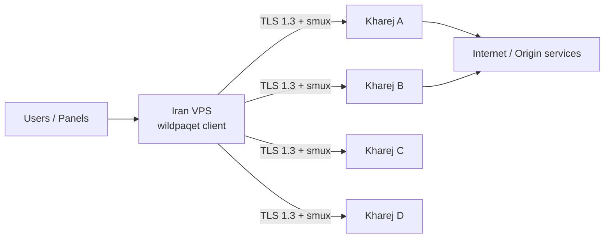

<div align="center">

# WildPaqet Tunnel

**Direct TLS 1.3 tunnel with a hardened raw-KCP fallback**

[](https://github.com/infowild/WildPaqet-Tunnel/tree/wild-paqet-v3)
[](https://github.com/infowild/WildPaqet-Tunnel)
[](https://github.com/infowild/WildPaqet-Tunnel/blob/wild-paqet-v3/wildpaqet.sh)
[](https://github.com/infowild/WildPaqet-Tunnel)

[فارسی](README.fa.md) · [Repository](https://github.com/infowild/WildPaqet-Tunnel) · [Core tree](./core) · [v3 install](docs/V3-INSTALL.md)

<br/>

### Stable (main)

```bash
bash <(curl -fsSL https://raw.githubusercontent.com/infowild/WildPaqet-Tunnel/main/wildpaqet.sh)
```

### WildPaqet v3 (this branch)

```bash
bash <(curl -fsSL https://raw.githubusercontent.com/infowild/WildPaqet-Tunnel/wild-paqet-v3/wildpaqet.sh)
```

Then:

```bash
wildpaqet
```

> After first run, menu **0 → 8** builds **WildPaqet Core v3** from source. See [docs/V3-INSTALL.md](docs/V3-INSTALL.md).
</div>

---

## Why WildPaqet?

WildPaqet is a production-oriented tunnel manager for Kharej ↔ Iran deployments. v3 defaults to **direct TLS 1.3 + smux** over normal kernel TCP; the hardened raw socket + KCP transport remains an explicit legacy fallback.

| | |
|---|---|
| **One command** | Install once, run forever with `wildpaqet` |
| **Dual role** | Abroad server + Iran entry (forward / SOCKS5) |
| **Multi tunnel** | Multiple services on one Iran VPS → many Kharej locations |
| **Multi port** | Comma-separated forwards with tcp / udp / both |
| **Safe cleanup** | Full uninstall restores script-owned system changes |

Forked and maintained from [Paqet-Tunnel-Manager](https://github.com/behzadea12/Paqet-Tunnel-Manager).

---

## Architecture



- **Kharej**: listens for the tunnel (`role: server`)
- **Iran**: terminates locally and **forwards ports** or exposes **SOCKS5**
- Same **32+ character secret** and **core version** on both sides; Iran trusts each Kharej certificate

---

## Quick Start

### 1) Launch (root)

```bash
bash <(curl -fsSL https://raw.githubusercontent.com/infowild/WildPaqet-Tunnel/wild-paqet-v3/wildpaqet.sh)
```

On first run the manager **auto-installs** the `wildpaqet` system command from this branch.

Then: **0 → 8** to build WildPaqet Core v3 from this branch.

### 2) Kharej

1. Option **2** → **v3 direct TLS**
2. Use the same shared secret on all Kharej servers
3. Copy each generated `server.crt` to Iran and concatenate a CA bundle

### 3) Iran

1. Option **3** → **v3 direct TLS**
2. Enter the four Kharej `IP:port` endpoints
3. Select the CA bundle and shared secret
4. Choose Port Forward or SOCKS5

### 4) Daily use

```bash
wildpaqet
```

> If `wildpaqet: command not found`, run the curl launcher once as root, or:
> ```bash
> export PATH="/usr/local/bin:$PATH" && hash -r
> ```

---

## Features

<table>
<tr>
<td width="50%">

### Tunnel ops
- Server / Client wizards
- Multi-port forwarding
- Built-in SOCKS5
- Multi-service (multi-location)
- systemd + optional auto-restart cron

</td>
<td width="50%">

### Ops & safety
- Connection protection (Anti-RST / NOTRACK)
- NAT helpers
- MTU / bulk config tools
- Telegram status bot
- Full uninstall (`YES` confirm)

</td>
</tr>
</table>

---

## Defaults (v7.1)

| Setting | Server | Client |
|--------|--------|--------|
| KCP mode | `normal` | `normal` |
| Connections | `1` | `1` |
| MTU | `1350` | `1350` |
| TCP preset | `default` | `default` |
| Encryption | `aes-128-gcm` | `aes-128-gcm` |
| Command | `wildpaqet` | `wildpaqet` |

---

## Direct TLS transport (9.0-v3)

The `tls` transport is direct TLS — there is no HTTP or WebSocket layer. It uses TLS 1.3, certificate verification, the common visible ALPN value `h2`, and a fail-closed post-TLS HMAC challenge with a timestamp and nonce. A replayed nonce or a timestamp outside the two-minute window is rejected before smux starts. Private CA-bundle deployments do not send SNI by default.

For multiple Kharej endpoints, the default is one outer connection per endpoint. Streams are distributed round-robin. Three consecutive failures open that endpoint's circuit for 30 seconds, with exponential cooldown capped at five minutes and a single half-open probe.

See [the v3 install guide](docs/V3-INSTALL.md) and the [client](core/example/client-tls.yaml.example) / [server](core/example/server-tls.yaml.example) examples.

## Legacy raw wire hardening (8.7-v2)

The tunnel leg between Iran and Kharej used to be easy to single out on the wire. Preset `default` now makes it behave like an ordinary TCP connection:

| Before | Now |
|--------|-----|
| A lone SYN with no answer, then data — worse than no handshake at all | Fail-closed three-way handshake: SYN retries use backoff and no tunnel data is sent without a valid `SYN-ACK` |
| SEQ/ACK were pseudo-random and unrelated to the bytes sent | SEQ counts bytes sent, ACK follows bytes received, timestamps echo the peer |
| A random ACK / fabricated timestamp echo was sent before the peer was ever seen | No ACK or `TSecr` is advertised until the peer's sequence space is actually observed |
| Every packet marked DSCP 46 (`TOS 184`), the expedited-forwarding class used by VoIP | No DSCP mark (`TOS 0`), like normal traffic |
| `IP.id` fixed at 0 on every DF packet — a bulk-tunnel giveaway | Moving `IP.id` (IPv4) / flow label (IPv6), like a real stack |
| Flows just went silent mid-stream | Best-effort `FIN,ACK` teardown on close |
| Packet-count timestamps and no outer loss recovery | Monotonic timestamps plus cumulative ACK and bounded outer TCP retransmission with the original SEQ |
| Tight reconnect loops and a fixed two-second keepalive | Exponential retry jitter and conservative `15s/60s` SMUX keepalive/timeout |

Update **both ends** — the handshake and outer ACK/retransmission behaviour require Iran and Kharej to run the same build. A missing or invalid `SYN-ACK` now fails closed instead of sending data on an unestablished flow.

Set `network.tcp.preset: "legacy"` on both sides to restore the old wire behaviour if you need to compare.

---

## Menu Map

| # | Action |
|---|--------|
| 0 | Install / update core & manager |
| 1 | Dependencies |
| 2 | Configure Kharej server |
| 3 | Configure Iran client |
| 4 | Manage one service |
| 5 | Manage all (NAT, protection, bulk) |
| 6 | Connectivity tests |
| 7 | Optimize (Safe/Auto network + DNS / Mirror) |
| 8 | **Full uninstall** |
| 9 | Telegram bot |
| 10 | Exit |

---

## Update

```bash
wildpaqet
# 0 → 5 Update script
```

Or re-run the curl one-liner.

---

## Uninstall (full cleanup)

```bash
wildpaqet
# option 8 → type YES
```

Removes **all** script/tunnel artifacts: services, cron, core + backups, `$INSTALL_DIR`, Core v2 source clone, configs, `wildpaqet` / legacy links, Telegram bot, script sysctl/limits, Paqet iptables protection, `/root/paqet`, `/root/paqet-backups`, and `/tmp/paqet*`. Optionally flushes the NAT table.

Network optimizer cleanup during uninstall is **snapshot-aware**: it restores the last `/var/lib/wildpaqet/netopt/snap-*` (so distro/user sysctl values come back), removes the WildPaqet sysctl/limits drop-ins and the `wildpaqet-qdisc.service` boot unit, then deletes the snapshot store. It never forces a blind `cubic`/`pfifo_fast` reset — if live `fq` is still present it is migrated to tunnel-safe `fq_codel`.

Does **not** remove distro packages (curl, iptables-persistent, golang, …). External third-party BBR installers (if you ran them separately) are left alone.

### Safe/Auto Network Optimizer (menu 7)

WildPaqet **8.6-v2+** ships a rewritten Safe/Auto optimizer for Ubuntu/Debian and RHEL-family hosts:

- Uses **`fq_codel`** only — never `fq` (which caps each kernel flow at ~100 packets and collapses raw-packet Paqet tunnels under load).
- Preserves **`mq`** multi-queue roots; only retargets `fq` leaves under `mq`, or replaces a single-queue `fq` root.
- Enables **BBR** only after `modprobe` + availability check; otherwise keeps/falls back to `cubic`.
- Conservative RAM-scaled buffers (no 256MB max / huge backlog / mega conntrack / forced `rp_filter` / `ip_forward`).
- Snapshots under `/var/lib/wildpaqet/netopt/` before apply; **Rollback** restores the last snapshot (not a blind `cubic`/`pfifo_fast` wipe).
- Remediates live qdisc on **default-route** interfaces only (`eth0`, `enp3s0`, …) — not Docker/VPN virtuals.
- **Do not** re-run old manager “Kernel Optimization” / remote `teddysun/bbr.sh` flows — they can reintroduce `fq`.

Menu: **7 → 1** Apply · **2** Status · **3** Rollback · **4** Reset owned drop-ins · DNS Finder / Mirror Selector.

---

## Troubleshooting

<details>
<summary><b>wildpaqet: command not found</b></summary>

```bash
bash <(curl -fsSL https://raw.githubusercontent.com/infowild/WildPaqet-Tunnel/main/wildpaqet.sh)
# or
ls -l /usr/local/bin/wildpaqet
/usr/local/bin/wildpaqet
export PATH="/usr/local/bin:$PATH" && hash -r
```
</details>

<details>
<summary><b>bad interpreter / No such file or directory</b></summary>

CRLF line endings. Reinstall manager (0 → 5) — installer strips `\r`.
</details>

<details>
<summary><b>GLIBC_2.34 not found</b></summary>

Use Ubuntu 22.04+ / Debian 12+, or build paqet from source on that host.
</details>

<details>
<summary><b>bind: address already in use</b></summary>

```bash
ss -tuln | grep 8443
lsof -i :8443
```
</details>

<details>
<summary><b>Core install fails</b></summary>

Put the archive in `/root/paqet/` and use option **0 → 2** (local file).  
Releases: https://github.com/hanselime/paqet/releases
</details>

---

## Requirements

- Linux VPS (Ubuntu / Debian / CentOS-like)
- Root privileges
- `libpcap`, `iptables`, `curl`
- Matching **paqet** core on both ends

---

## Credits

- [paqet](https://github.com/hanselime/paqet) — hanselime  
- [Paqet-Tunnel-Manager](https://github.com/behzadea12/Paqet-Tunnel-Manager) — original manager  

---

## License

MIT — aligned with upstream projects.

<div align="center">

**WildPaqet** · by [InfoWild](https://github.com/infowild)

`bash <(curl -fsSL https://raw.githubusercontent.com/infowild/WildPaqet-Tunnel/main/wildpaqet.sh)`

</div>
